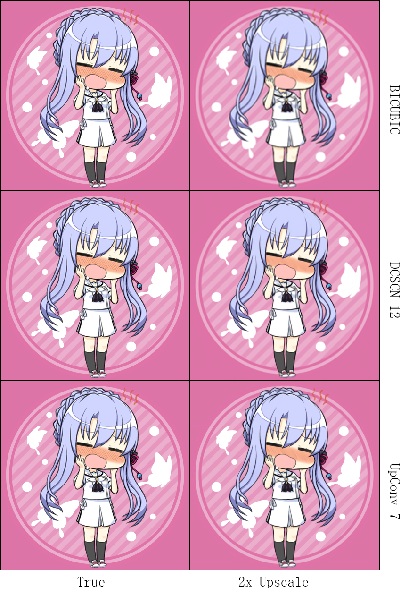
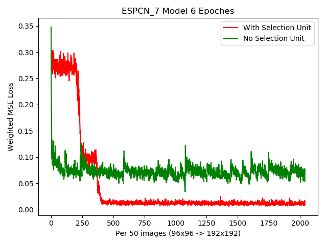

# Waifu2x

 Re-implementation on the original [waifu2x](https://github.com/nagadomi/waifu2x) in PyTorch with additional super resolution models. 

## Dependencies 
* Python 3x
* PyTorch 0.4

Optinal: Nvidia GPU. Model inference can run in cpu only. 

## Demos
Examples can be found in the "example" folder, but they may require users to tweak some lines to load image. This project is under development, so it might not be user-friendly.  


 ## Models
 #### Models Comparison
 
I am not able to distinguish the outcome between DCSCN and Upconv, which is the main model in waifu2x. Note, the first model runs 5x slower than the second model. 

 ##### 2x upscale
  Images are from [Key: サマボケ(Summer Pocket)](http://key.visualarts.gr.jp/summer/).

 
(Ensembling is NOT used.)

 ##### Memory usage
 The image is cropped into 48x48 overlapping patches and then merged back to save memory and reduce runtime. 
 
 
 ##### Another Example
 The image is 2x down scaled by Image.BICUBIC and then up scaled.
 

 
 
 ##### Scores
 The list will be updated after I add more models. 
 
Images are twitter icons (PNG) from [Key: サマボケ(Summer Pocket)](http://key.visualarts.gr.jp/summer/). They are cropped into non-overlapping 96x96 patches and down-scaled by 2. Then images are re-encoded into JPEG format with quality from [75, 95]. Scores are PSNR and MS-SSIM. 

|       | Total Parameters | BICUBIC  | Random* |
| :---: | :---:   | :---:  |  :---:  |
| DCSCN 12 |1,889,974 | 31.5358 (0.9851) |     31.1457 (0.9834) |   
| Upconv 7| 552,480|  31.4566 (0.9788) |   30.9492 (0.9772)   |

*uniformly select down scale methods from Image.BICUBIC, Image.BILINEAR, Image.LANCZOS.
            


 

 #### DCSCN
[Fast and Accurate Image Super Resolution by Deep CNN with Skip Connection and Network in Network](https://github.com/jiny2001/dcscn-super-resolution#fast-and-accurate-image-super-resolution-by-deep-cnn-with-skip-connection-and-network-in-network)
 
 DCSCN is very interesting as it  has relatively quick forward computation, and  both the shallow model (layerr 8) and deep model (layer 12) are quick to train. The settings are different from the paper. 
 
 * I use exponential decay to decrease the number of feature filters in each layer. [Here](https://github.com/jiny2001/dcscn-super-resolution/blob/a868775930c6b36922897b0203468f3f1481e935/DCSCN.py#L204) is the original filter decay method. 
 
 * I also increase the reconstruction filters from 48 to 128. 
 
 * All activations are replaced by SELU. Dropout and weight decay are not added neither because they significantly increase the training time. 
 
 * The loss function is changed from MSE to L1. 
   According to [Loss Functions for Image Restoration with Neural
Networks](https://www.google.com/url?sa=t&rct=j&q=&esrc=s&source=web&cd=4&cad=rja&uact=8&ved=0ahUKEwi7kuGt_7_bAhXrqVQKHRqhCcUQFghUMAM&url=http%3A%2F%2Fresearch.nvidia.com%2Fsites%2Fdefault%2Ffiles%2Fpubs%2F2017-03_Loss-Functions-for%2Fcomparison_tci.pdf&usg=AOvVaw1p0ndOKRH2ZaEsumO7d_bA),  L1 seems to be more robust and converges faster than MSE.  But the authors find the results from L1 and MSE are [similar](https://github.com/jiny2001/dcscn-super-resolution/issues/29). 
 
 
 I need to thank jiny2001 (one of the paper's author) to test the difference of SELU and PRELU. SELU seems more stable and has fewer parameters to train. It is a good drop in replacement
 >layers=8, filters=96 and dataset=yang91+bsd200. 
 
 The details can be found in [here]( https://github.com/jiny2001/dcscn-super-resolution/issues/29). 
 
 
 
  
 A pre-trained 12-layer model as well as model parameters are available. The model run time is around 3-5 times of Waifu2x. The output quality is usually visually indistinguishable, but its PSNR and SSIM are  bit higher. Though, such comparison is not fair since the 12-layer model has around 1,889,974 parameters, 5 times more than waifu2x's Upconv_7 model. 
 
 
### Waifu2x Original Models 
Models can load waifu2x's pre-trained weights.  The function ```forward_checkpoint```  sets the ```nn.LeakyReLU``` to compute data inplace.

#### Upconv_7
Original waifu2x's model. PyTorch's implementation with cpu only is around 5 times longer for large images.  The output images have very close PSNR and SSIM scores compared to images generated from the [caffe version](https://github.com/lltcggie/waifu2x-caffe) , thought they are not identical. 

#### Vgg_7
Not tested yet, but it is ready to use. 


 #### ESPCN_7
 * Need more configurations and tests. 
 

Modified from [Real-Time Single Image and Video Super-Resolution Using an Efficient Sub-Pixel Convolutional Neural Network](https://arxiv.org/abs/1609.05158).  Computations are done on the low resolution images, and the  last layer is Pixel Shuffle that scale up the input image. 

A selection unit is added in between of convolutional filters.  Details on the selection unit can be found in [A Deep Convolutional Neural Network with Selection Units for Super-Resolution](http://openaccess.thecvf.com/content_cvpr_2017_workshops/w12/papers/Choi_A_Deep_Convolutional_CVPR_2017_paper.pdf). But the activation function is changed to SELU. It seems quite powerful.

 


 ## Image Processing
 High resolution PNGs are cropped into 96x96 non-overlapping patches, so some parts of images are dropped. A lesson I learn is that DON'T save processed patches. I save over 2x80 thousands small patches (both high and low resolution), and I fail to open the folder. 
 
 High resolution images are loaded all at once in memory and cut into patches. Low resolution patches are also saved in  memory. They are then dumped into PyTorch's dataloader and feed into the neural net. 
 

Re-sampling methods  are uniformly chosen among ```[PIL.Image.BILINEAR, PIL.Image.BICUBIC, PIL.Image.LANCZOS]``` , so different patches in the same image might be down-scaled in different ways. 

Image noise are from JPEG format only. They are added by re-encoding PNG images into PIL's JPEG data with various quality. Noise level 1 means quality ranges uniformly from [75, 95]; level 2 means quality ranges uniformly from [50, 75]. 
 
 
 
 ## TODO: 
 * [ESPCN] for real time ? 
 * [DRRN](http://cvlab.cse.msu.edu/pdfs/Tai_Yang_Liu_CVPR2017.pdf) (planned)
 (Note: DRRN is not realistic for CPU only usage. A modified version might be used.)
 * and find some interesting paper
 
 
