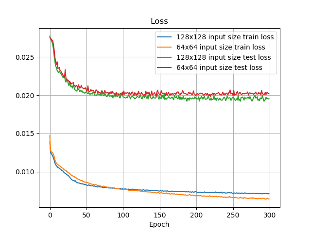
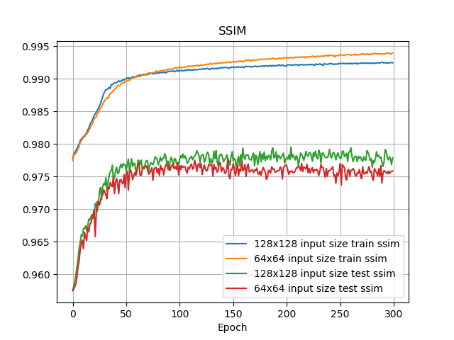
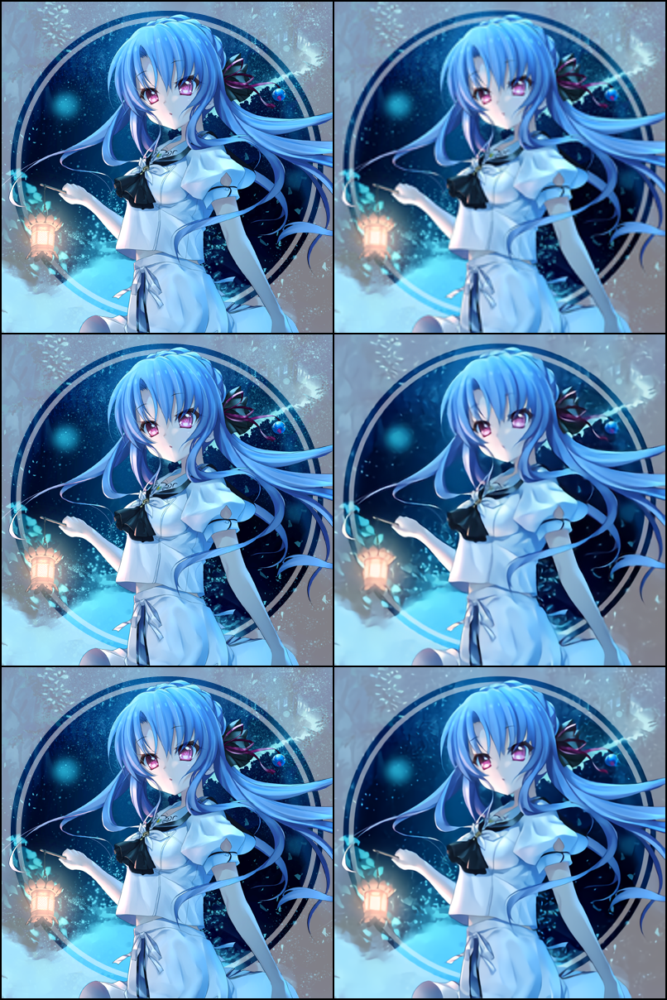
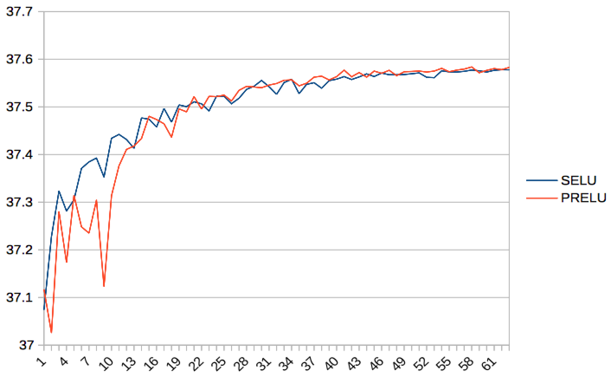
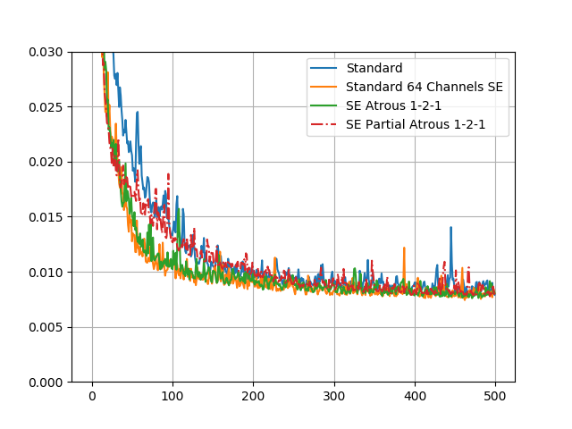

# Waifu2x

 Re-implementation on the original [waifu2x](https://github.com/nagadomi/waifu2x) in PyTorch with additional super resolution models. This repo is mainly used to explore interesting super resolution models. User-friendly tools may not be available now ><.  

## Dependencies 
* Python 3x
* [PyTorch](https://pytorch.org/) >= 1 ( > 0.41 shall also work, but not guarantee)
* [Nvidia/Apex](https://github.com/NVIDIA/apex/) (used for mixed precision training, you may use the [python codes](https://github.com/NVIDIA/apex/tree/master/apex/fp16_utils) directly)

Optinal: Nvidia GPU. Model inference (32 fp only) can run in cpu only. 

## What's New
* Add [CARN Model (Fast, Accurate, and Lightweight Super-Resolution with Cascading Residual Network)](https://github.com/nmhkahn/CARN-pytorch). Model Codes are adapted from the authors's [github repo](https://github.com/nmhkahn/CARN-pytorch). I add [Spatial Channel Squeeze Excitation](https://arxiv.org/abs/1709.01507) and swap all 1x1 convolution with 3x3 standard convolutions. The model is trained in fp 16 with Nvidia's [apex](https://github.com/NVIDIA/apex). Details and plots on model variant can be found in [docs/CARN](./docs/CARN)

* Dilated Convolution seems less effective (if not make the model worse) in super resolution, though it brings some improvement in image segmentation, especially when dilated rate increases and then decreases. Further investigation is needed. 

## How to Use 
Compare the input image and upscaled image
```python
from utils.prepare_images import *
from Models import *
from torchvision.utils import save_image
model_cran_v2 = CARN_V2(color_channels=3, mid_channels=64, conv=nn.Conv2d,
                        single_conv_size=3, single_conv_group=1,
                        scale=2, activation=nn.LeakyReLU(0.1),
                        SEBlock=True, repeat_blocks=3, atrous=(1, 1, 1))
                        
model_cran_v2 = network_to_half(model_cran_v2)
checkpoint = "model_check_points/CRAN_V2/CARN_model_checkpoint.pt"
model_cran_v2.load_state_dict(torch.load(checkpoint, 'cpu'))
# if use GPU, then comment out the next line so it can use fp16. 
model_cran_v2 = model_cran_v2.float() 

demo_img = "input_image.png"
img = Image.open(demo_img).convert("RGB")

# origin
img_t = to_tensor(img).unsqueeze(0) 

# used to compare the origin
img = img.resize((img.size[0] // 2, img.size[1] // 2), Image.BICUBIC) 

# overlapping split
# if input image is too large, then split it into overlapped patches 
# details can be found at [here](https://github.com/nagadomi/waifu2x/issues/238)
img_splitter = ImageSplitter(seg_size=64, scale_factor=2, boarder_pad_size=3)
img_patches = img_splitter.split_img_tensor(img, scale_method=None, img_pad=0)
with torch.no_grad():
    out = [model_cran_v2(i) for i in img_patches]
img_upscale = img_splitter.merge_img_tensor(out)

final = torch.cat([img_t, img_upscale])
save_image(final, 'out.png', nrow=2)
```

 ## Training
 
 If possible, fp16 training is preferred because it is much faster with minimal quality decrease. 
 
 Sample training script is available in `train.py`, but you may need to change some liens. 
 
 ###  Image Processing
 Original images are all at least 3k x 3K. I downsample them  by LANCZOS so that  one side has at most 2048, then I randomly cut them into 256x256 patches as target  and use 128x128 with jpeg noise as input images. All input patches have at least 14 kb, and they are stored in SQLite with BLOB format. SQlite seems to have [better performance](https://www.sqlite.org/intern-v-extern-blob.html) than file system for small objects. H5 file format may not be optimal because of its larger size. 
 
 Although convolutions can take in any sizes of images, the content of image matters. For real life images, small patches may maintain color,brightness, etc variances in small regions, but for digital drawn images, colors are added in block areas. A small patch may end up showing entirely one color, and the model has little to learn. 
 
 For example, the following two plots come from CARN and have the same settings, including initial parameters. Both training loss and ssim are lower for 64x64, but they perform worse in test time compared to 128x128. 
 
 
 
  

Downsampling methods  are uniformly chosen among ```[PIL.Image.BILINEAR, PIL.Image.BICUBIC, PIL.Image.LANCZOS]``` , so different patches in the same image might be down-scaled in different ways. 

Image noise are from JPEG format only. They are added by re-encoding PNG images into PIL's JPEG data with various quality. Noise level 1 means quality ranges uniformly from [75, 95]; level 2 means quality ranges uniformly from [50, 75]. 
 

 ## Models
 Models are tuned and modified with extra features. 
 
 
* [DCSCN 12](https://github.com/jiny2001/dcscn-super-resolution) 

* [CRAN](https://github.com/nmhkahn/CARN-pytorch)
 
 #### From [Waifu2x](https://github.com/nagadomi/waifu2x)
 * [Upconv7](https://github.com/nagadomi/waifu2x/blob/7d156917ae1113ab847dab15c75db7642231e7fa/lib/srcnn.lua#L360)
 
 * [Vgg_7](https://github.com/nagadomi/waifu2x/blob/7d156917ae1113ab847dab15c75db7642231e7fa/lib/srcnn.lua#L334)
 
 * [Cascaded Residual U-Net with SEBlock](https://github.com/nagadomi/waifu2x/blob/7d156917ae1113ab847dab15c75db7642231e7fa/lib/srcnn.lua#L514) (PyTorch codes are not available and under testing)
 
 #### Models Comparison
   Images are from [Key: サマボケ(Summer Pocket)](http://key.visualarts.gr.jp/summer/).
 
 The left column is the original image, and the right column is bicubic, DCSCN, CRAN_V2
 



 
 ##### Scores
 The list will be updated after I add more models. 
 
Images are twitter icons (PNG) from [Key: サマボケ(Summer Pocket)](http://key.visualarts.gr.jp/summer/). They are cropped into non-overlapping 96x96 patches and down-scaled by 2. Then images are re-encoded into JPEG format with quality from [75, 95]. Scores are PSNR and MS-SSIM. 

|       | Total Parameters | BICUBIC  | Random* |
| :---: | :---:   | :---:  |  :---:  |
| CRAN V2| 2,149,607 | 34.0985 (0.9924) |  34.0509 (0.9922) |
| DCSCN 12 |1,889,974 | 31.5358 (0.9851) | 31.1457 (0.9834) |   
| Upconv 7| 552,480|  31.4566 (0.9788) |   30.9492 (0.9772)   |

*uniformly select down scale methods from Image.BICUBIC, Image.BILINEAR, Image.LANCZOS.
            


 

 #### DCSCN
[Fast and Accurate Image Super Resolution by Deep CNN with Skip Connection and Network in Network](https://github.com/jiny2001/dcscn-super-resolution#fast-and-accurate-image-super-resolution-by-deep-cnn-with-skip-connection-and-network-in-network)
 
 DCSCN is very interesting as it  has relatively quick forward computation, and  both the shallow model (layerr 8) and deep model (layer 12) are quick to train. The settings are different from the paper. 
 
 * I use exponential decay to decrease the number of feature filters in each layer. [Here](https://github.com/jiny2001/dcscn-super-resolution/blob/a868775930c6b36922897b0203468f3f1481e935/DCSCN.py#L204) is the original filter decay method. 
 
 * I also increase the reconstruction filters from 48 to 128. 
 
 * All activations are replaced by SELU. Dropout and weight decay are not added neither because they significantly increase the training time. 
 
 * The loss function is changed from MSE to L1. 
   According to [Loss Functions for Image Restoration with Neural
Networks](https://www.google.com/url?sa=t&rct=j&q=&esrc=s&source=web&cd=4&cad=rja&uact=8&ved=0ahUKEwi7kuGt_7_bAhXrqVQKHRqhCcUQFghUMAM&url=http%3A%2F%2Fresearch.nvidia.com%2Fsites%2Fdefault%2Ffiles%2Fpubs%2F2017-03_Loss-Functions-for%2Fcomparison_tci.pdf&usg=AOvVaw1p0ndOKRH2ZaEsumO7d_bA),  L1 seems to be more robust and converges faster than MSE.  But the authors find the results from L1 and MSE are [similar](https://github.com/jiny2001/dcscn-super-resolution/issues/29). 
 
 
 I need to thank jiny2001 (one of the paper's author) to test the difference of SELU and PRELU. SELU seems more stable and has fewer parameters to train. It is a good drop in replacement
 >layers=8, filters=96 and dataset=yang91+bsd200. 
 
 The details can be found in [here]( https://github.com/jiny2001/dcscn-super-resolution/issues/29). 
 
 
 
 A pre-trained 12-layer model as well as model parameters are available. The model run time is around 3-5 times of Waifu2x. The output quality is usually visually indistinguishable, but its PSNR and SSIM are  bit higher. Though, such comparison is not fair since the 12-layer model has around 1,889,974 parameters, 5 times more than waifu2x's Upconv_7 model. 
 
 #### CARN
 Channels are set to 64 across all blocks, so residual adds are very effective. Increase the channels to 128 lower the loss curve a little bit but doubles the total parameters from 0.9 Millions to 3 Millions. 32 Channels has much worse performance. Increasing the number of cascaded blocks from 3 to 5 doesn't lower the loss a lot. 
  
 SE Blocks seems to have the most obvious improvement without increasing the computation a lot. Partial based padding seems have little effect if not decrease the quality. Atrous convolution is slower about 10%-20% than normal convolution in Pytorch 1.0, but there are no obvious improvement. 

Another more effective model is to add upscaled input image to the final convolution. A simple bilinear upscaled image seems sufficient. 

More examples on model configurations can be found in [docs/CARN folder](./docs/CARN/carn_plot_loss.md)




### Waifu2x Original Models 
Models can load waifu2x's pre-trained weights.  The function ```forward_checkpoint```  sets the ```nn.LeakyReLU``` to compute data inplace.

#### Upconv_7
Original waifu2x's model. PyTorch's implementation with cpu only is around 5 times longer for large images.  The output images have very close PSNR and SSIM scores compared to images generated from the [caffe version](https://github.com/lltcggie/waifu2x-caffe) , thought they are not identical. 

#### Vgg_7
Not tested yet, but it is ready to use. 
